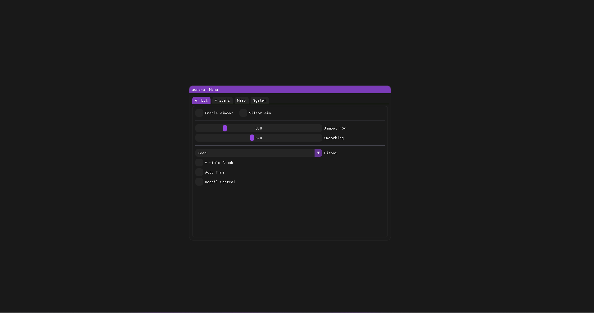

# Modern ImGui Cheat Menu UI Template


A clean, modern ImGui-based cheat menu UI template with rounded elements and smooth animations. Designed for DirectX 11 applications, this template provides a professional foundation for game cheat menus or other overlay applications.

## Features

- 🎨 **Modern UI Design**:
  - Rounded corners and smooth animations
  - Customizable color themes (Purple, Blue, Red, Green)
  - Responsive layout with proper DPI scaling

- 📑 **Organized Tab System**:
  - Aimbot settings tab
  - Visuals/ESP tab
  - Miscellaneous features tab
  - System information tab

- ⚙️ **Configuration Options**:
  - Toggle switches for various features
  - Sliders for adjustable values
  - Dropdown selectors for multiple options

- 🔧 **Technical Foundation**:
  - DirectX 11 rendering backend
  - ImGui for fast UI development
  - Clean, modular code structure

## Disclaimer

⚠️ **This is purely a UI template for educational purposes.**  
This repository contains only the user interface components with no actual game hacking functionality. It demonstrates how to create a modern-looking menu using ImGui and DirectX 11.

## Getting Started

### Prerequisites
- Visual Studio (2019 or newer recommended)
- Windows SDK
- DirectX 11 compatible GPU

### Installation
1. Clone this repository
   ```bash
   git clone https://github.com/agentmkay/aura-ui.git
